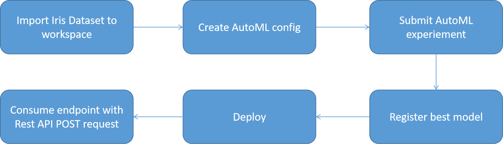
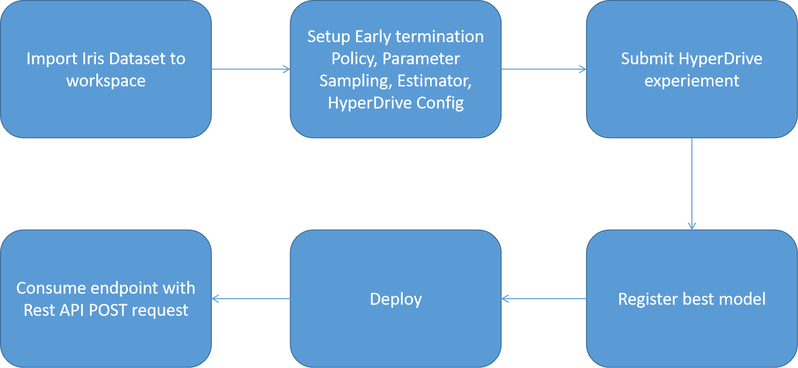

# Azure Machine Learning Engineer Capstone Project

## Table of contents
   * [Project Overview](#Project-Overview)
   * [Project requirements](#Project-requirements)
   * [Dataset](#Dataset)
   * [AutoML](#AutoML)
   * [AutoML Results](#AutoML-Results)
   * [Deployment](#Deployment)
   * [HyperDrive](#HyperDrive)
   * [HyperDrive results](#HyperDrive-results)
   * [Screen Recording](#Screen-Recording)
   * [Standout Suggestions](#Standout-Suggestions)

## Project Overview
Capstone project for Udacity Azure Machine Learning Engineer NanoDegree. 

The problem is to create programmatically an AutoML experiement and a HyperDrive Experiment from Jupyter notebooks and deploy one of the models to create an endpoint and consume that endpoint with POST request. 

* Below image shows the architecture we will follow for the AutoML experiment. 



* Below image shows the architecture we will follow for the HyperDrive experiment. The project in this case requires only one of the models to be deployment and AutoML model was chosen to be deployed as a rest endpoint so the deployment step and the consumption step shown below is not executed in case of hyperdrive model. 



***
## Project requirements
* An Azure ML workspace
* A compute instance
* Jupyter lab.
* env.yml has detailed package dependencies

***
## Dataset

Dataset for this project is Iris for classifying Iris plant. 

https://archive.ics.uci.edu/ml/datasets/iris

Data has four columns describing the characteristics of the plant and one more column for the plant class. There are three different classes thereby making this a multiclass classification. 

We can access the data using the UCI link above using the ```from_delimited_files``` method from ```Dataset.Tabular```. We register the dataset to the workspace. Below script is how we can achieve this.  
```
example_data = 'https://archive.ics.uci.edu/ml/machine-learning-databases/iris/iris.data'
dataset = Dataset.Tabular.from_delimited_files(example_data, header=False)        
#Register Dataset in Workspace
dataset = dataset.register(workspace=ws,
                                   name="Iris Classification",
                                   description="Classification problem for iris species")

```
***
## AutoML

To train an automl model a few steps need to be executed to setup the experiement. 

1. We setup the workspace.
2. Create an experiment
3. Setup the compute
4. Import the dataset into the workspace and register to datasets using Dataset package
5. Create automl settings with parameters to timeout, concurrent iterations and metric to use
6. Create automl config to use compute, data, target and early stopping
7. Submit the experiment and wait for completion. 

*** 
## AutoML Results
The following model and hyper parameters search was created by the AutoML experiement. The below run result displays all the important parts of the child run - steps used like DataTransformer, working_dir, hyperparameters searched for getting the best model. We have a stack ensemble which includes minmaxscaler and a RandomForest model with below shown configuration.
```
Run(Experiment: automl-model,
Id: AutoML_caf261ae-59c9-46ec-8f48-a0d74b5ddd7d_3,
Type: azureml.scriptrun,
Status: Completed)
Pipeline(memory=None,
         steps=[('datatransformer',
                 DataTransformer(enable_dnn=False, enable_feature_sweeping=True, feature_sweeping_config={}, feature_sweeping_timeout=86400, featurization_config=None, force_text_dnn=False, is_cross_validation=True, is_onnx_compatible=False, observer=None, task='classification', working_dir='/mnt/batch/tasks/shared/LS_root/mount...
                class_weight=None, criterion='entropy',
                max_depth=None, max_features='log2',
                max_leaf_nodes=None, max_samples=None,
                min_impurity_decrease=0.0,
                min_impurity_split=None,
                min_samples_leaf=0.01,
                min_samples_split=0.10368421052631578,
                min_weight_fraction_leaf=0.0,
                n_estimators=50, n_jobs=1,
                oob_score=False, random_state=None,
                verbose=0, warm_start=False))],
         verbose=False)
Y_transformer(['LabelEncoder', LabelEncoder()])
```

The following images show the models trained during the child runs for the automl experiment and their accuracies in descending order. We can see that the stack ensemble model has the highest accuracy and is the best model. We can also look at the graph of all the models with their AUC weighted in this case. We can also select other metrics using the run_details method in Jupyter lab.


*** 
## Deployment

Input:

```
{
  "data":
    [
        { 
            "Column1":2.3,
            "Column2":3.4,
            "Column3":2.9,
            "Column4":5.6
        }
    ]
}
```
The automl model was deployed to create an endpoint to utilise as rest api and sent post requests to the endpoint. The model during the deployment process shows the state as transitioning and once the deployment is complete shows healthy. It also shows the consume tab which we can use to get the rest API link and also a python script to test and use our rest API.  


***
## HyperDrive:

To create a hyperdrove experiment a few steps need to be executed to setup the experiement. 

1. We setup the workspace.
2. Create an experiment
3. Setup the compute
4. Import the dataset into the workspace and register to datasets using Dataset package
5. Define an early termination policy using the BanditPolicy
```
BanditPolicy(
    evaluation_interval=2, slack_factor=0.1
)
```
6. Use RandomParameterSampling with different parameters using --C and --max_iter of logistic regression. 
```
"--C": uniform(0.1, 1),
"--max_iter": choice(50, 75, 100, 150)
````
7. Use the training script to create an estimator. 
8. Create HyperDrive Config with the earlier parameters like estimators, policy, hyperparameter sampling, primary metric goal. 
9. Submit the experiment and wait for completion
10. Get the best model and save. 

The below images show the run_details output of the hyperdrive experiment aand we can see the child runs in the running state. The second and third images display the graph the parameter 'C' vs 'max-iter' and Accuracy vs Child run number. 


***
## HyperDrive results

Hyperdrive results gave an accuracy of 0.9777 as indicated below. 
```
[{'run_id': 'HD_845b306e-6d37-4f5f-9c9f-1f610cf347c7_8', 'hyperparameters': '{"--C": 0.7772069615440829, "--max_iter": 100}', 'best_primary_metric': 0.9777777777777777, 'status': 'Completed'}]
```

Using the get_best_run_by_primary_metric we can get the model that has the highest accuracy and register and save it to use it further for deployment.


## Screen Recording

Look at the screenshots folder for more images. This screen recording gives a short overview of the project in action.

https://youtu.be/LhCW3kwu8-A

## Standout Suggestions

1. Creating newer features with existing features. 
2. Training hyperdrive experiment for more parameters.
3. Automl model can run for longer to get better models and more options with higher accuracy. 
4. Having better computing power for decreasing latency. 